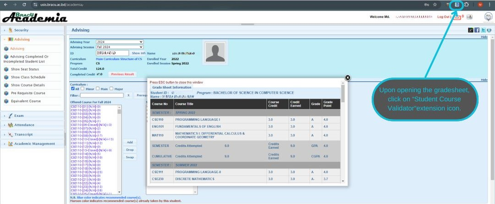

# Student Course Validator Chrome Extension

The **Student Course Validator** Chrome extension is a helpful tool for advisors of BRACU. This tool validate key advising parameters, such as probation status, instances of multiple failures, credit limit issues, completion of prerequisite courses, and gaps count in academic history affecting course retakes. Developed by Md. Khaliduzzaman Khan Samrat, it aims to enhance academic advising and support. 

##### Follow the installation guide to install this extension.
###### Note: This tool currently only works for the 'CSE' and 'CS' programs of BRACU.

## Index

  - [Features Overview](#features-overview)
  - [Installation Guide for Chrome browser](#extension-installation-guide-for-chrome-browser)
  - [Installation Guide for Firefox browser](#extension-installation-guide-for-firefox-browser)
  - [Usage Guide](#usage-guide)
  - [Update Guide](#extension-update-guide)
  - [Security Statement for the "Student Course Validator" Extension](#security-statement-for-the-student-course-validator-extension)
  - [Development](#development)

## Features Overview

- **Probation Status:**  
  Alerts if the student is on probation based on their academic performance and CGPA.

- **Multiple Fail Status:**  
  Alerts if any course has more than 3 failing grades, signaling the need for immediate attention.

- **Credit Limit:**  
  Alerts for any issues where the student’s total registered credits exceed the allowable limit set by the institution.

- **Prerequisite Status:**  
  Alerts if any courses taken this semester violate prerequisite requirements, ensuring students are following the necessary academic progression.

- **Semester Gap for Retake:**  
  Alerts if any courses retaken this semester have a gap of over 2 semesters (excluding the RS semester), potentially affecting academic standing and course eligibility.

## Extension Installation Guide for Chrome browser

| **Steps**                              | **Image**                     |
|----------------------------------------|--------------------------------|
| **Step 1:** Click on latest release to download or [go to the download page from here](https://github.com/isaamrat/Student-Course-Validator/releases/tag/v1.0.1) |  |
| **Step 2:** Download the extension zip by clicking on the zip file. |  |
| **Step 3:** Extract the downloaded zip file. |  |
| **Step 4:** Click on the extension icon |  |
| **Step 5:** Open the extensions manager by clicking the Extensions Manager or by navigating to `chrome://extensions` |  |
| **Step 6:** Enable "Developer mode" by toggling the switch in the top-right corner. |  |
| **Step 7:** Click on "Load Unpacked" to add the extension. |  |
| **Step 8:** Select the previously extracted extension folder. |  |
| **Step 9:** From the extensions menu pin the Student Course Validator extension |  |

## Extension Installation Guide for Firefox browser

| **Step**                            | **Instructions**                                                                                     |
|---------------------------------|--------------------------------------------------------------------------------------------------|
| **1. Download the extension**   | [Download the extension from here](https://github.com/isaamrat/Student-Course-Validator/releases/tag/v1.0.1) or from latest release, file to download "Student-Course-Validator-v1.0.1.zip" |
| **2. Extract the downloaded zip file**             | Ensure the extension files (e.g., `manifest.json`, icons, others) are ready in a folder.                                                                      |
| **3. Add the Add-ons on firefox**           | Click the menu button (three horizontal lines) in the top right corner. Select **“Add-ons and Themes”** or press `Ctrl + Shift + A`.                                    |
| **4. Go to Debugging**          | Click the gear icon ⚙️ in the top right of the Add-ons Manager. Choose **“Debug Add-ons”**.                                                                       |
| **5. Load the Add-on**          | Click **“Load Temporary Add-on...”**  In the file dialog, select the `manifest.json` file from the extracted extension folder. Click**Open**.|
|**6. Pin the Extension**        | After adding the extension, find the extension in the toolbar. Right-click on its icon and select **“Pin to Overflow Menu”** to keep it easily accessible.|
| **6. Usage**       | For usage follow the **[Usage Guide](#usage-guide)**          |
| **7. Note**             | This is a custom extension that is not signed by Firefox. As a result, you will need to load this extension manually each time you open the Firefox browser. Please follow the steps 3-5 to ensure the extension is loaded and ready for use. |

## Usage Guide

| **Steps**                              | **Image**                     |
|----------------------------------------|--------------------------------|
| **Step 1:** On the advising pannel click on the "Previous Result" button to open the gradesheet of the student. |  |
| **Step 2:** Upon opening the gradesheet click on "Student Course Validator" extension icon to open the extension. |  |
| **Step 3:** Click on the validate button of the extension. Please make sure the gradesheet is visible before clicking the validate. |  |
| **Step 4:** The reports will be shown in the window. |  |

## Extension Update Guide

| Step                            | Instructions                                                                                     |
|---------------------------------|--------------------------------------------------------------------------------------------------|
| **1. Download the latest version of the extension**   | **[Download the extension from here](https://github.com/isaamrat/Student-Course-Validator/releases/tag/v1.0.1)** or from latest release, file to download "Student-Course-Validator-v.....zip" |
| **2. Extract the downloaded zip file**             | Ensure the extension files (e.g., `manifest.json`, icons, others) are ready in a folder.                                                                      |
| **3. Remove the extension**           | Remove the existing installed extension from the browser.                                    |
| **4. Re-install the latest version of the extension**          | For Chrome Follow this [Installation Guide for Chrome browser](#extension-installation-guide-for-chrome-browser). <br> For Firefox browser follow this [Installation Guide for Chrome browser](#extension-installation-guide-for-firefox-browser).                                                                       |

## Security Statement for the "Student Course Validator" Extension

| **Security Statement** |
|------------------------|
| This extension prioritize security and user privacy in the development of the **Student Course Validator** extension. This tool is designed solely to assist with academic advising by scraping data that is already visible on the BRACU USIS website, processing it to help advisors and students make informed decisions. |
| **Key Security Points:** |
| **No External Communication:** The extension does not communicate with any external servers or databases. All data scraping happens directly within the user's browser from the currently loaded webpage, ensuring that no sensitive information leaves the user's device. |
| **Limited Permissions:** The extension only requires access to the active tab on the BRACU USIS domain and permission to run scripts (`activeTab` and `scripting` permissions). This ensures that the extension only operates when users are on the BRACU USIS site, and it cannot access any other information outside of this domain. |
| **No Data Storage:** The extension does not store or persist any data. It processes the scraped data in real-time and sends it directly to the popup interface without saving anything locally or remotely. |
| **Read-Only Operations:** This extension operates in a purely read-only mode. It reads the course information, credit data, and student records displayed on the webpage, but it never alters or submits any data to the server. |
| **Technical Functionality:** |
| - The extension scrapes data from tables on the BRACU USIS advising page, such as credit limits, student IDs, course prerequisites, and probation statuses. It works solely within the confines of the HTML structure provided by the BRACU USIS interface. |
| - Data such as student ID, name, credit information, and course statuses are extracted using simple DOM (Document Object Model) queries. |
| - The data is processed locally in the browser and presented directly in the extension's popup without being transmitted elsewhere. |
| **Transparency in Functionality:** |
| The source code is available for review, and users can inspect the extension’s `manifest` and `contentScript.js` file to verify that the extension does nothing more than scrape and display the student information. No background processes run outside of the BRACU USIS site, and no third-party libraries are used for data handling. |
| By keeping the scope of the extension restricted to scraping visible information, we ensure that your data remains private, and no additional security risks are introduced. |
| --- |
| **Thank you** for trusting the **Student Course Validator** extension to assist in your advising process. |


## Development

### Prerequisites:
- Node.js and npm installed.
- A basic understanding of JavaScript, React, and Chrome extension development.

### Setup:
1. Clone the repository:
    ```bash
    git clone https://github.com/isaamrat/Student-Course-Validator
    ```
2. Navigate to the project folder:
    ```bash
    cd student-course-validator
    ```
3. Install dependencies:
    ```bash
    npm install
    ```
4. Run the development build:
    ```bash
    npm run dev
    ```

### Build:
To build the project for production and generate files for the Chrome extension:

```bash
npm run build
```
